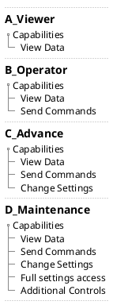

# Create EUI Users

| **Requested by:** | **AURA** |
|-------------------|----------|
| **Doc. Code**     | #{documentCode}       |
| **Editor:**       | A. Izpizua         |
| **Approved by:**  | J. Garcia         |

## Index

- [Create EUI Users](#create-eui-users)
  - [Index](#index)
  - [Introduction](#introduction)
  - [Safety related](#safety-related)
  - [User management](#user-management)
    - [User levels](#user-levels)
    - [User management application](#user-management-application)
    - [Create a new user](#create-a-new-user)
    - [Change Password](#change-password)
    - [Manage the file](#manage-the-file)

## Introduction

This document shows how to create new user in the EUI. It will also show how to change privileges to an existing one.

## Safety related

## User management

The user management is done with the UserAccess_wf_TEKNIKER library . This is library needs a encrypted configuration file. This configuration file defines the available users, their level and their password.

In next sections, first the user level are explained, and the application to manage the user is shown.

### User levels

There are defined 4 user levels and its user level has access to different elements in the EUI.

The deferent capabilities in the EUI are shown in next list.

- **View Data**. The users with these privilege can view data in the EUI, but they can't not move or make any other actions. They can't not send any command to the PXIs or any change settings.

- **Send Commands**. The users with this privilege can send commands to the PXI to perform actions like, move or enable elements. This privilege does not allow to a change any setting.

- **Change settings**. The users with this privilege can some settings. Some settings are not shown for users with this privilege since they are considered as critical for telescope performance or integrity. Also this users can not save settings, they can only change temporary.

- **Full settings access**. The users with this privilege can change all the settings available and they can save them.

- **Additional controls**. The user with this privilege see some additional controls that allow some special operations with the telescope.

The user levels are shown in next list

- **A_Viewer**:These are viewer users. They are view only and cannot send commands to the telescope.

- **B_Operator**: These are operator users. They can send commands to the telescope, but cannot change the settings.

- **C_Advance**: These are advanced users. They can send commands to the telescope and change the most basic settings,
always within the preset limits for each of them. This type of user cannot save settings permanently and their changes are temporary.

-**D_Maintenance**: These are maintenance users. They can perform all operations and set all settings within the limits pre-established for each of them.

And the correspondence between user level and capabilities is shown in next figure

### User management application

To manage the users the application XXX must be used

### Create a new user

In the Name there can't be any special character or blanks.

### Change Password

### Manage the file

Save file

Revert changes

