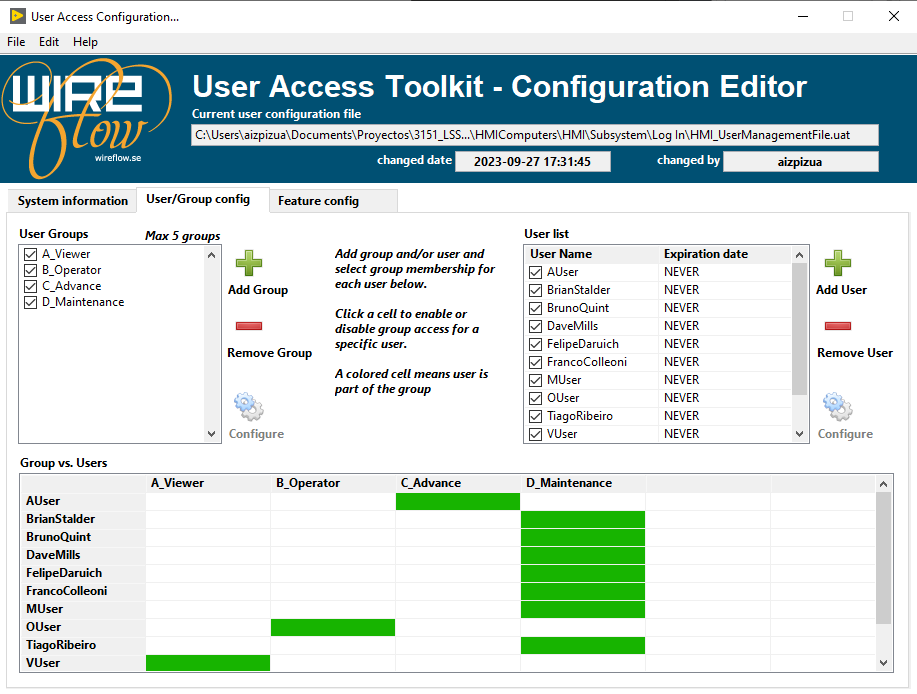

# Create EUI Users

| **Requested by:** | **AURA** |
|-------------------|----------|
| **Doc. Code**     | #{documentCode}       |
| **Editor:**       | A. Izpizua         |
| **Approved by:**  | J. Garcia         |

## Index

- [Create EUI Users](#create-eui-users)
  - [Index](#index)
  - [Introduction](#introduction)
  - [Safety related](#safety-related)
  - [User management](#user-management)
    - [User levels](#user-levels)
    - [User management application](#user-management-application)
    - [Create a new user](#create-a-new-user)
    - [Change Password](#change-password)
    - [Manage the file](#manage-the-file)

## Introduction

This document shows how to create new user in the EUI. It will also show how to change privileges to an existing one.

## Safety related

## User management

The user management is done with the UserAccess_wf_TEKNIKER library . This is library needs a encrypted configuration file. This configuration file defines the available users, their level and their password.

In next sections, first the user levels are explained, and the application to manage the users is shown.

### User levels

There are defined 4 user levels and its user level has access to different elements in the EUI.

The different capabilities in the EUI are shown in next list.

- **View Data**. The users with these privilege can view data in the EUI, but they can't not move or make any other actions. They can't not send any command to the PXIs or any change settings.

- **Send Commands**. The users with this privilege can send commands to the PXI to perform actions like, move or enable elements. This privilege does not allow to a change any setting.

- **Change settings**. The users with this privilege can change some settings. Some settings are not shown for users with this privilege since they are considered as critical for telescope performance or integrity. Also this users can not save settings, they can only change settings temporarily.

- **Full settings access**. The users with this privilege can change all the settings available and they can save them.

- **Additional controls**. The user with this privilege see some additional controls that allow some special operations with the telescope.

The user levels are shown in next list

- **A_Viewer**:These are viewer users. They are view only and cannot send commands to the telescope.

- **B_Operator**: These are operator users. They can send commands to the telescope, but cannot change the settings.

- **C_Advance**: These are advanced users. They can send commands to the telescope and change the most basic settings,
always within the preset limits for each of them. This type of user cannot save settings permanently and their changes are temporary.

- **D_Maintenance**: These are maintenance users. They can perform all operations and set all settings within the limits pre-established for each of them.

And the correspondence between user level and capabilities is shown in next figure

### User management application

To manage the users the application "User Management Tool" must be used.It is located /usr/local/TMA_UserManagement, and there is a shortcut in the desktop.

When running the tool just wait some time for user login. Any M_Maintenance privileged user can manage the user.

After properly login the User Access Toolkit - Configuration Editor form wire flow is shown.

In the first window there is a button that allow to select the user configuration file manually. Use this button only if the tool does not open properly the users configuration file.

### Create a new user

To create a new user follow next steps

1. Press in the "Add User" button

2. In the User Configuration window insert the new user Name, leaving the Active as checked. In the Name there can't be any special character or blanks.
  
3. Then press the "Configuration" button to change the password

4. In the "Change password" window crate a "New Password" and "Confirm New Password", then press OK, in this window and in the previous window

5. In the Group Vs Users found the new user and click in the desired group for give the user the desired privileges. The groups that a user belongs to appears green colored in the table

### Change Password

To change the password of and existing user, select the user and double click or click in "Conigure" button. Then continue with the same steps shown in the [Create a new user](#create-a-new-user) section, from step 3 on.

### Manage the file

When all the modifications with the user are done, the user configuration file must be saved. The file is save in File->Save...

>>**The EUI must be restarted to changes take effect**

The changes can be reverted using the Edit->Revert action.

